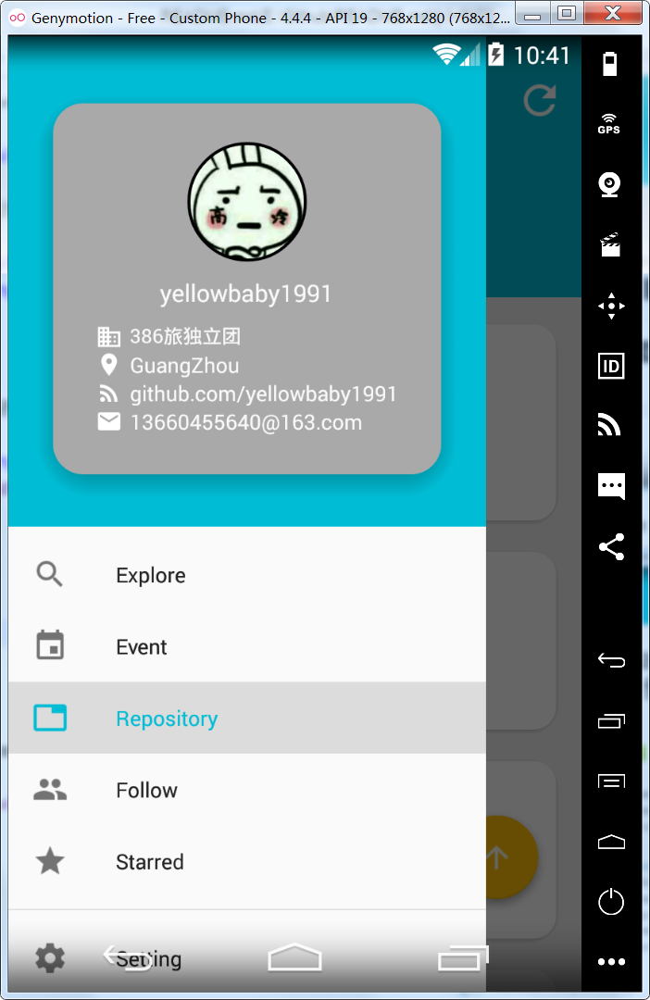

* [Github-可能是最好用的github客户端](#github-可能是最好用的github客户端)
	* [项目的起因](#项目的起因)
* [本文的目的](#本文的目的)
* [功能介绍](#功能介绍)
	* [Explore](#explore)
	* [RepositoryDetail](#repositorydetail)
	* [UserDetail](#userdetail)
	* [RepositoryList](#repositorylist)
	* [UserList](#userlist)
	* [Event](#event)
	* [Setting](#setting)

# Github-可能是最好用的github客户端
## 项目的起因

Github上一个看起来很漂亮的Github客户端

成功引起了我的注意

但是，它不开源

作者在贴了一堆截图后留下了自己的商务合作邮箱

我不开心所以也想做一个

# 本文的目的

 1. 如果你是青铜玩家：希望本文提供的一些资料（如API，架构，三方，功能实现思路等）可以给你一些参考价值
 2. 如果你是王者玩家：欢迎指出问题和建议，尤其是优化和架构方面

  
# 功能介绍
  ## Explore

 1. 浏览Repository和User，使用选项卡切换，并且将浏览过的数据缓存在本地（本应用所有数据都做了缓存，并且缓存时间可由用户定制）

 2. 支持关键字搜索Repository和User，可以选择排序方式（Most star，Best match，Most fork，Rencent update等），可以按标签换语言分类（排序方式和标签可用用户定制）

 

## RepositoryDetail

 1. Repository简要信息查看，并且可以进行star，unstar，fork操作

 

 2. 异步加载ReadMe，按markdown格式显示ReadMe
 
 
 
 3. 显示code树，查看代码内容，因为缓存的原因，点击加载过的节点可以秒加载
 
 
 
## UserDetail

 1. User简要信息查看，并且可以进行follow，unfollow操作

## RepositoryList

 1. 查询自己的Repository
 

 
 2. 查询自己Star过的Repository

 3. 查询RepositoryDetail被fork过的Repository

 4. 查询UserDetail被拥有的Repository

## UserList

 1. 查询自己，以及其他User的following和follower

 
 
 2. 查询RepositoryDetail的Contributors和Stargazers
 
 

## Event

 1. 可以查询，自己，User，Repository的Event

## Setting

 1. 设置Explore页面首先查询的语言，右下方应该有几个语言选项，默认的排序方式

